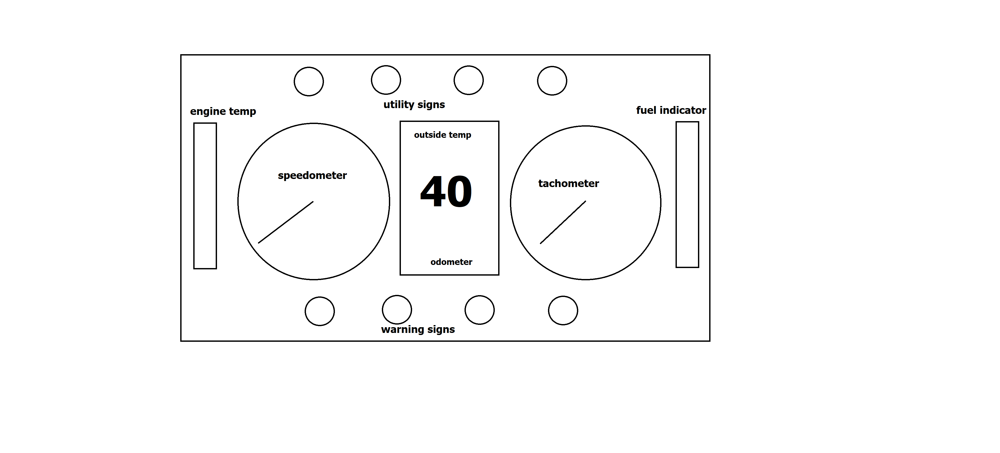

# Human Computer Interaction - Spring 2021 
## Car Dashboard

Report page: https://hardeek100.github.io/p2HardikPoudel/

Here are 5 examples of the car dashboards that I found with worst design

2018 mini cooper se countryman

 Buick Reatta
 

Fiat Multipla

Toyota Prius 

Buick Skylark

The most common features of a car dashboard are:
1. Watch speed
2. Watch fuel
3. Outside temperature
4. Time

and some rarely used features of a car dashboard are:
1. Warning sign
2. odometer
3. engine temperature

Controls that the user interacts with are:
- Steering wheel
- accelerator
- brakes
- gearbox
- clutch
- side light switch
- headlight switch
- extra buttons 

Some common mistakes with the current designs
- reading wrong warning sign or missing them
- unable to see speed in dashboards like Buick Skylark and Buick Reatta

Some of the improvements that can be made with the current designs are:
- make warning signs more visible and organized
- put least used features on the sides such as temperature
- make most used feature more visible such as make digital speed visible in the dashboard with the analog speedometer.

Here is my sketch of the solution

